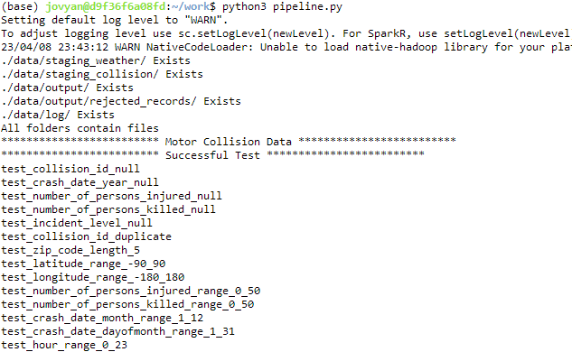
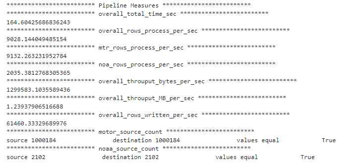
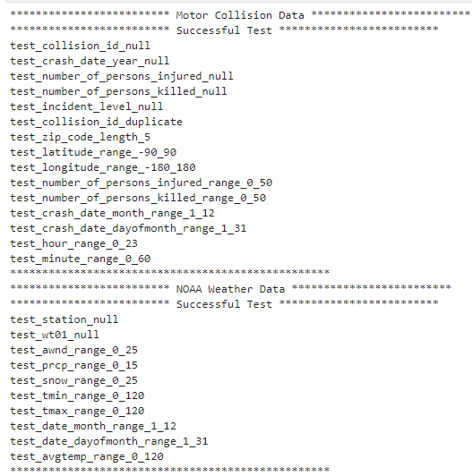
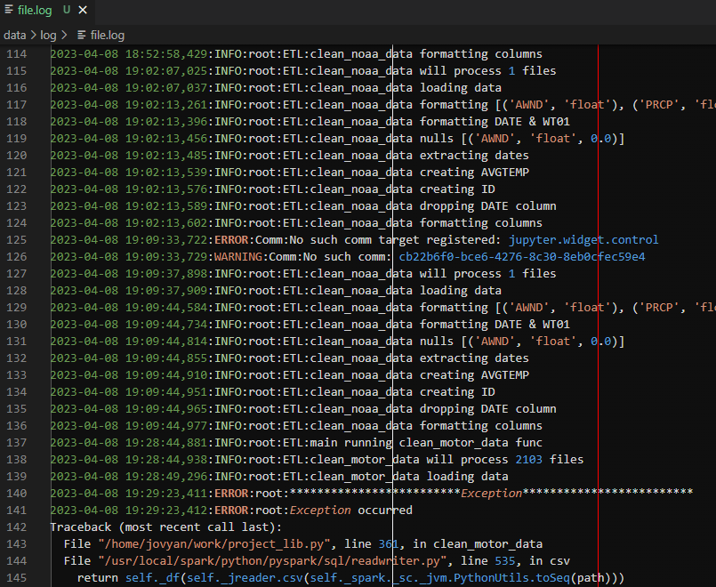

# DATA ENGINEERING CAPSTONE
***
## Project Overview
Vision Zero is a fictitious non-profit organization that advocates for road safety and aims to eliminate traffic fatalities and severe injuries. The organization operates on the principle that all traffic accidents are preventable, and it seeks to promote a holistic approach to road safety that encompasses engineering, education, and enforcement. Vision Zero advocates for the redesign of streets and roadways to prioritize the safety of pedestrians, cyclists, and motorists. Additionally, the organization promotes the adoption of policies that reduce speeding, improve traffic enforcement, and increase public awareness of road safety issues. Through its initiatives, Vision Zero is working to create safer streets and reduce the number of traffic-related injuries and fatalities. The organization has been successful in many cities around the world, and its model has been adopted by numerous governments and organizations as a framework for improving road safety.

Data plays a critical role in reducing vehicle accidents. With the advancements in technology, vehicles are now equipped with sensors and cameras that collect data about the surrounding environment and the behavior of other drivers. This data can be analyzed to identify potential hazards and predict the likelihood of accidents. Additionally, data on driver behavior, such as speeding, distracted driving, and fatigue, can be used to identify patterns and develop targeted interventions to address these issues. Furthermore, data on road infrastructure, weather conditions, and traffic patterns can help identify areas with a higher risk of accidents and prioritize safety improvements. By leveraging data in these ways, we can develop more effective strategies for reducing vehicle accidents and improving road safety for everyone.

The scope of the project is to use data from NYC Open data regarding Motor Vehicle Collisions - Crashes and weather data obtained vai the noaa weather API. The Motor Vehicle Collision data contains a total 1 Million data points and the noaa data has weather for these data points. The data will be prepared with the goal to be used in analytics to help further the mission of Vision Zero.

The architecture goal for the project is to design a robust and scalable Data Lake that can efficiently handle large volumes of data. The Data Lake will be created using a combination of Docker, Spark, and Python, which will enable fast and reliable processing of the data. The data will be ingested from a storage bucket and processed using Docker containers, which can be easily scaled up or down depending on the processing needs. The processed data will be stored in the form of Parquet files in the destination folder, which can be easily accessed and analyzed by downstream applications. To optimize costs, the Docker containers can be disabled after processing the data, which will help in reducing the technology costs associated with the project. Overall, the architecture design will help in creating an efficient and cost-effective Data Lake that can support the needs of the business

## DATA

### [Motor Vehicle Collisions - Crashes](https://data.cityofnewyork.us/Public-Safety/Motor-Vehicle-Collisions-Crashes/h9gi-nx95)

The Motor Vehicle Collisions crash table contains details on the crash event. Each row represents a crash event. The Motor Vehicle Collisions data tables contain information from all police reported motor vehicle collisions in NYC. The police report (MV104-AN) is required to be filled out for collisions where someone is injured or killed, or where there is at least $1000 worth of damage.

**CRASH DATE** - Occurrence date of collision Date

**CRASH TIME** - Occurrence time of collision Time

**BOROUGH** - Borough where collision occurred Plain Text

**ZIP CODE** - Postal code of incident occurrence Plain Text

**LATITUDE** - Latitude coordinate for Global Coordinate System, WGS 1984, decimal degrees (EPSG 4326) Number

**LONGITUDE** - Longitude coordinate for Global Coordinate System, WGS 1984, decimal degrees (EPSG 4326) Number

**LOCATION** - Latitude , Longitude pair Location

**ON STREET NAME** - Street on which the collision occurred Plain Text

**CROSS STREET NAME** - Nearest cross street to the collision Plain Text

**OFF STREET NAME** - Street address if known Plain Text

**NUMBER OF PERSONS INJURED** - Number of persons injured Number

**NUMBER OF PERSONS KILLED** - Number of persons killed Number

**NUMBER OF PEDESTRIANS INJURED** - Number of pedestrians injured Number

**NUMBER OF PEDESTRIANS KILLED** - Number of pedestrians killed Number

**NUMBER OF CYCLIST INJURED** - Number of cyclists injured Number

**NUMBER OF CYCLIST KILLED** - Number of cyclists killed Number

**NUMBER OF MOTORIST INJURED** - Number of vehicle occupants injured Number

**NUMBER OF MOTORIST KILLED** - Number of vehicle occupants killed Number

**CONTRIBUTING FACTOR VEHICLE 1** - Factors contributing to the collision for designated vehicle Plain Text

**CONTRIBUTING FACTOR VEHICLE 2** - Factors contributing to the collision for designated vehicle Plain Text

**CONTRIBUTING FACTOR VEHICLE 3** - Factors contributing to the collision for designated vehicle Plain Text

**CONTRIBUTING FACTOR VEHICLE 4** - Factors contributing to the collision for designated vehicle Plain Text

**CONTRIBUTING FACTOR VEHICLE 5** - Factors contributing to the collision for designated vehicle Plain Text

**COLLISION_ID** - Unique record code generated by system. Primary Key for Crash table. Number

**VEHICLE TYPE CODE 1** - Type of vehicle based on the selected vehicle category (ATV, bicycle, car/suv, ebike, escooter, truck/bus, motorcycle, other) Plain Text

**VEHICLE TYPE CODE 2** - Type of vehicle based on the selected vehicle category (ATV, bicycle, car/suv, ebike, escooter, truck/bus, motorcycle, other) Plain Text

**VEHICLE TYPE CODE 3** - Type of vehicle based on the selected vehicle category (ATV, bicycle, car/suv, ebike, escooter, truck/bus, motorcycle, other) Plain Text

**VEHICLE TYPE CODE 4** - Type of vehicle based on the selected vehicle category (ATV, bicycle, car/suv, ebike, escooter, truck/bus, motorcycle, other) Plain Text

**VEHICLE TYPE CODE 5** - Type of vehicle based on the selected vehicle category (ATV, bicycle, car/suv, ebike, escooter, truck/bus, motorcycle, other) Plain Text

### [NOAA Weather Data](https://www.ncei.noaa.gov/)

* Weather Station
    * **NAME** - NY CITY CENTRAL PARK, NY US
    * **Network:ID** - GHCND:USW00094728

**AWND** - Average wind speed Number

**DATE** - Date of weather measure Date

**PRCP** - Precipitation Number

**SNOW** - Snowfall Number

**STATION** - Weather Station of observation

**TMAX** - Maximum temperature Plain Number

**TMIN** - Minimum temperature Number

**WT01** - Fog, ice fog, or freezing fog (may include heavy fog) Logical

### DATA MODEL

### Schema Motor Vehicle Collisions - Crashes

|Name |Description|Type|
|:-----:|:--------:|:--------:|
|borough |Borough where collision occurred|string|
|zip_code |Postal code of incident occurrence|integer|
|latitude |Latitude coordinate for Global Coordinate System|float|
|longitude |Longitude coordinate for Global Coordinate System|float|
|on_street_name |Street on which the collision occurred|string|
|cross_street_name |Nearest cross street to the collision|string|
|off_street_name |Street address if known|string|
|number_of_persons_injured |Number of persons injured|integer|
|number_of_persons_killed |Number of persons killed|integer|
|collision_id |Unique record code generated by system|integer|
|crash_date_year|Year number|integer|
|crash_date_month|Month number|integer|
|crash_date_dayofmonth|Month number|integer|
|hour|Hour Number|integer|
|minute|Minute Number|integer|
|incident_level| Identifies severity of accident|string|
|id| record number used to track data quality failures|integer|

### Schema NOAA Weather Data

|Name |Description|Type|
|:-----:|:--------:|:--------:|
|awnd |Average wind speed Number|float|
|prcp |Precipitation Number|float|
|snow |Snowfall Number|float|
|station |Weather Station of observation|string |
|tmax |Maximum temperature Plain Number|integer|
|tmin  |Minimum temperature Number|integer |
|wt01 |Fog, ice fog, or freezing fog (may include heavy fog)|boolean|
|AVGTEMP|Average of TMIN & TMAX|float|
|date_year|Year of weather|integer|
|date_month|Month of weather|integer|
|date_dayofmonth|Date of weather|integer|
|avgtemp| Average of tmin & tmax|float|
|id| record number used to track data quality failures|integer|

## LIBRARIES USED
* pyspark
* logging
* pandas
* requests

## FILES


- data **- Data folder**
    - log **- Log Folder**
        - file.log **- File**
    - motor_collision_data **- Pickle data**
    - output **- Folder for data**
        - rejected_records **- Folder for bad records**
    - staging_collision **- Extracted data for motor collision**
    - staging_weather **- Extracted data for NOAA**
    - weather_data **- Pickle data**
- imgs **- Project pictures**
- Capstone Project.ipynb **- Data exploration for Capstone**
- pipeline.py **- Script to run pipeline**
- project_lib.py **- Project library**
- README.md  **- Project information**


## RUN PROJECT
```
1. docker pull jupyter/pyspark-notebook

2. Load project to environment

3. run pipeline.py on terminal

```
### Screenshots
#### Running project via terminal


#### Pipeline Measures


#### Data Validation


#### Process log

